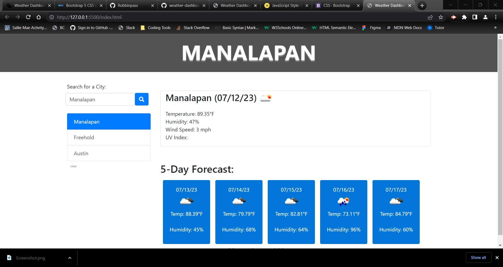

# Weather dashboard

## Description 
This weather dashboard allows users to get current weather as well as the 5-day forecast for the city of their choice.  The user inputs a city name in the search area and clicks search to display the relevant weather information. This web application processes data received from multiple server-side API requests and dynamically updates elements on the page with JavaScript. Added Bootstrap as a CSS framework makes the web application  responsive, user friendly and visually appealing. 

## Table of Contents 
- [Weather dashboard](#weather-dashboard)
  - [Description](#description)
  - [Table of Contents](#table-of-contents)
  - [User Story](#user-story)
  - [Acceptance Criteria](#acceptance-criteria)
  - [Installation](#installation)
      - [Links](#links)
      - [Frameworks: Bootstrap 5.3.0 (CSS)](#frameworks-bootstrap-530-css)
      - [Application works with following APIs](#application-works-with-following-apis)
  - [Usage](#usage)
  - [Mock-up](#mock-up)
  - [Credits](#credits)
    - [Andrew Robbins](#andrew-robbins)
  - [License](#license)

## User Story
- AS A traveler

  I WANT to see the weather outlook for multiple cities

  SO THAT I can plan a trip accordingly

## Acceptance Criteria
- GIVEN a weather dashboard with form inputs
  - WHEN I search for a city
  - THEN I am presented with current and future conditions for that city and that city is added to the search history
  - WHEN I view current weather conditions for that city
  - THEN I am presented with the city name, the date, an icon representation of weather conditions, the temperature, the humidity, and the wind speed
  - WHEN I view future weather conditions for that city
  - THEN I am presented with a 5-day forecast that displays the date, an icon representation of weather conditions, the temperature, the wind speed, and the humidity
  - WHEN I click on a city in the search history
  - THEN I am again presented with current and future conditions for that city

## Installation 

*Weather dashboard app runs in browser and feature dynamically updated HTML, CSS, and JavaScript.*

#### Links 
- **Link to deployed website:** [https://robbinpass.github.io/weather-dashboard/](https://robbinpass.github.io/weather-dashboard/)
- **Link to GitHub repository:** [https://github.com/Robbinpass/weather-dashboard](https://github.com/Robbinpass/weather-dashboard)

#### Frameworks: [Bootstrap 5.3.0 (CSS)](https://getbootstrap.com/)

#### Application works with following APIs

- Open Weather - [https://openweathermap.org/](https://openweathermap.org/)

## Usage 
Upon entering the web application for the first time, you are presented with weather condition in your approximate vicinity. You can get a more precise reading of your location by allowing the web application to use your location to view weather conditions in your city. You can also search for weather conditions by typing any city in the world and then clicking the "Search" button. The page will then update with weather condition based on the city the user has entered. 

Each time you search for a new city it will then save it's name in "Searched locations" section by utilizing local storage functionality and displayed as link on the page.

## Mock-up 

 

## Credits 

### Andrew Robbins

[https://github.com/Robbinpass](https://github.com/Robbinpass)

## License

MIT License